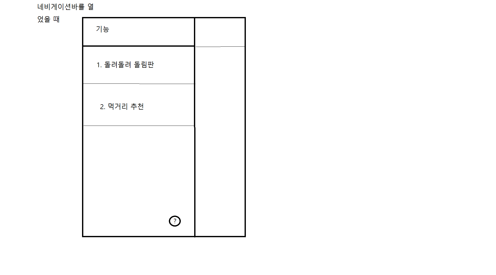
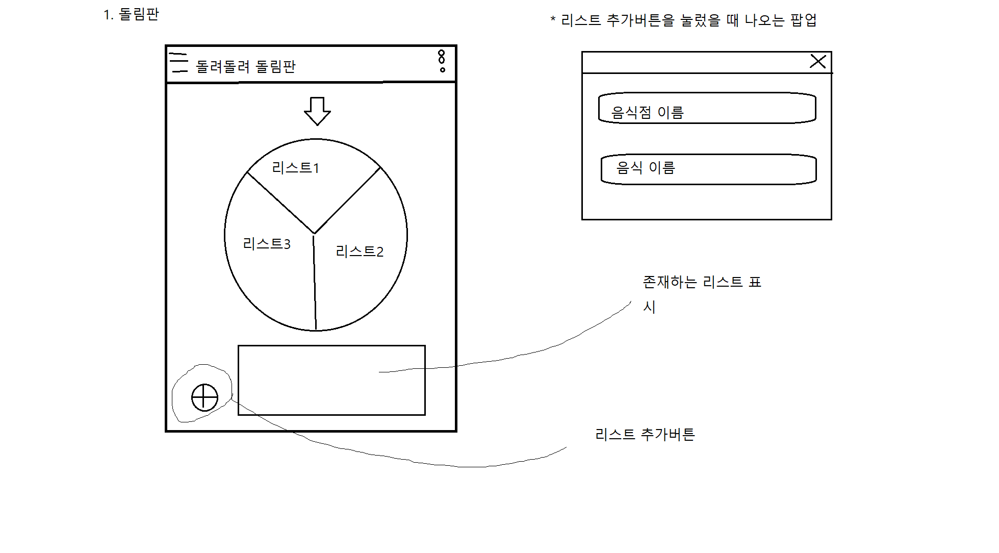

FoodDecisionMaker프로젝트의 두 번째 개발노트
2019년 11월 27일
----------------------------------------------
두 번째 모임은 첫 번째 모임 때 발전과제로 제시했던 안드로이드 스튜디오에 대한 공부를 점검하는 시간을 가지며 시작하였습니다.

안드로이드 스튜디오에서는 Kotlin 언어와 Java언어 더 나아가서 C++언어까지 지원을 하는데, 저희는 이번 1학년 2학기 때 Java관련 과목을
수강하기 때문에 Java언어를 사용하기로 결정했습니다.
 
 두 번째 모임에서는 저희의 최종적인 결과물인 어플리케이션의 레이아웃이나 인터페이스의 모습을 구상하는 시간을 가졌습니다. 
 
 
 
 처음 앱을 실행하였을 때, 왼쪽 위에 네비게이션바가, 오른쪽 위에는 환경설정으로 들어가는 버튼이 있으며, 앱의 본문에는 앱의 소개와
 도움말등이 적힌 화면을 볼 수 있습니다. 네비게이션 바를 열게 되면 다음과 같은 화면을 볼 수 있습니다.
 
 
 
 네비게이션 바의 첫 번째 항목은 사용자가 직접 항목(음식점의 이름이나 음식종류, 메뉴등)을 작성하여 랜덤으로 하나를 골라주는 기능이고,
 두 번째 항목은 앱 자체에서 거리, 가격, 음식 종류, 인기 있는 음식, 음식점 추천을 제공하는 기능입니다.
 
 
 
 항목을 작성하여 랜덤으로 하나를 골라주는 기능은 다음과 같이 돌림판이 하나 있고, 돌림판 아래에 항목을 직접 작성하는 버튼과 존재하는 모든
 항목을 보여주는 리스트가 있습니다. 돌림판을 돌려주게 되면 돌림판이 회전을 멈췄을 때 항목들 중 하나를 가리키게 됩니다. 이 기능은 아직 확정된
 기능이 아니며, 돌림판이 아닌 다른 랜덤항목 선별 방식을 사용하게 될 수 있습니다.
 
 
 
 두 번째 기능을 눌렀을 때 나오는 화면에서는 총 5가지의 세부 항목이 있으며, 세부 항목에서 구현을 할 기능들은 사진에 나타나 있습니다. 
 세부항목의 모든 선택사항들을 선택한 후에는 그 선택사항들에 가장 많이 부합하는 음식점 중 가장 레이팅이 높은 음식점을 선별해 줍니다.
 
 이 두 번째 기능에서 추가 발전사항으로 생각하고 있는 기능은, 앱에서 추천하는 음식점이 선별되었을 때, 지도앱처럼 그 음식점의 위치를 표현해 주는
 기능을 넣는 것입니다. 하지만 이 지도기능을 구현하는 과정에서 구글이나 네이버의 API를 따오는 것이 문제가 되고 있습니다. 때문에 이 기능은
 앱의 필수적인 기능들을 모두 구현한 후 시행될 기능이라고 생각합니다.
 
다음 모임까지 발전과제로는 API사용 방법에 대한 공부 및 안드로이드 스튜디오와 관련된 내용 공부를 마치고, 개발에 도움이 되는
오픈소스를 깃허브에서 찾아오는 것으로 마무리하며 첫 번째 모임을 마쳤습니다.
